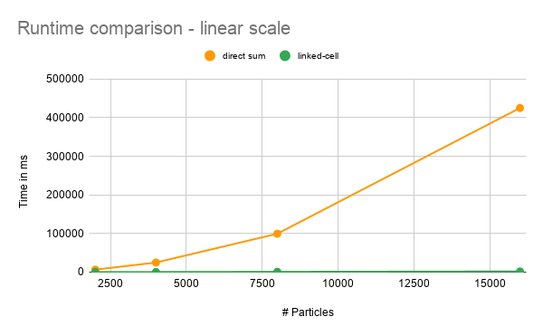
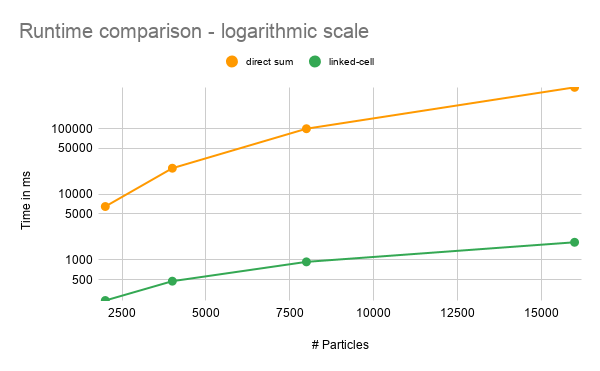

MolSim
===

# Group B #
Members:
* Höbenreich, Jonas
* Paluca, Denis
* Trouvain, Mira

# Build and Run Instructions #
## Requirements
- log4cxx

## MolSim program - collision of two bodies ##

* Compile with 

      cmake -DDISABLE_DOXYGEN=ON -DCMAKE_BUILD_TYPE=Debug  -G "CodeBlocks - Unix Makefiles" {PATH_TO_PROJECT}
      make MolSim -j <1.5 * number of cores>
      
* run main program with parameters specified in assignment:

      ./MolSim {PATH_TO_PROJECT}/inputs/a3_task2_collision_lc.xml

### General program call

    ./MolSim <PATH_TO_INPUT_FILE>

or for performance testing:

    ./MolSim <PATH_TO_INPUT_FILE> -pt

## Tests ##

* Compile with

      cmake -DDISABLE_DOXYGEN=ON -DCMAKE_BUILD_TYPE=Debug  -G "CodeBlocks - Unix Makefiles" {PATH_TO_PROJECT}
      make Tests_run -j <1.5 * number of cores>

* run
      
      ctest

  or

      cd tests/
      ./Tests_run

## Doxygen documentation ##
* Build with

      cmake -DCMAKE_BUILD_TYPE=Debug  -G "CodeBlocks - Unix Makefiles" {PATH_TO_PROJECT}
      make doc_doxygen

# Input file format #

see [XSD file](src/xml/molsimInput.xsd)

# Media #
[Video - Task 2: Collision of two bodies](https://drive.google.com/file/d/12thG13Oj26iUzEZ3my9naAB5nmuISLV6/view?usp=sharing)
[Video - Task 4: Drop-fall](https://drive.google.com/file/d/1ahz5X56Vt4SmJJ1Fd7X0tPWC1-TSlGDy/view?usp=sharing)

# Performance measurements

The OS/hardware the measurements were made on:

* OS: Ubuntu 20.04.1 LTS x86_64  
* Kernel: 5.4.0-58-generic  
* CPU: Intel i7-7500U (4) @ 3.500GHz  
* GPU: Intel UHD Graphics 620  
* GPU: NVIDIA GeForce 940MX
* Memory: 6077MiB / 15900MiB

### Results:

input files: `{Project_Path}/inputs/a3_task2_comparison/`

input data:
* 2D squares of 100x10, 100x20, 100x40, 100x80 and 100x160 particles each
* delta_t = 0.0005 and t_end = 0.1

Runtimes in ns (without file/log output):

Particles | direct sum | linked-cell
--- | --: | --:
1000 | 1544680309 | 130595151
2000 | 6493965204 | 239922982
4000 | 24898246000 | 472800630
8000 | 99550734283 | 931202627
16000 | 425216887565 | 1851370202

# Misc #
* Compiler used: gcc 9.3.0
* CMake version: 3.16.3
* Google Tests version: 1.10.0

